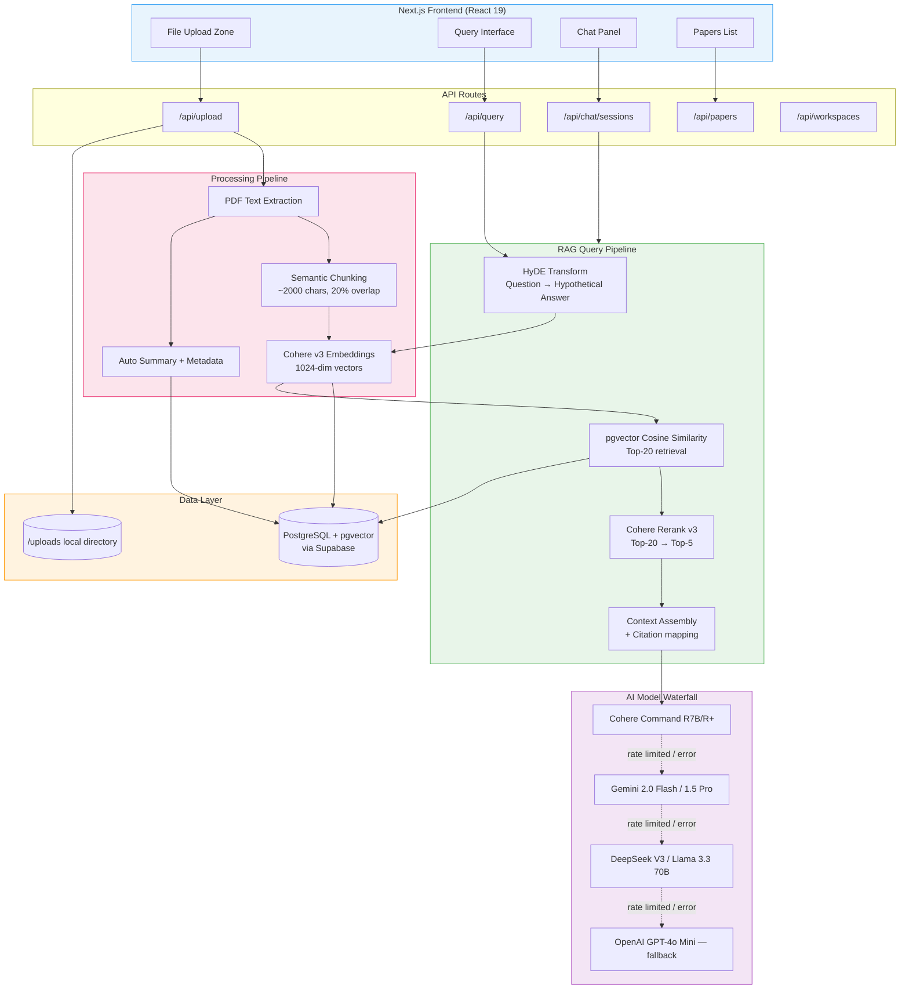
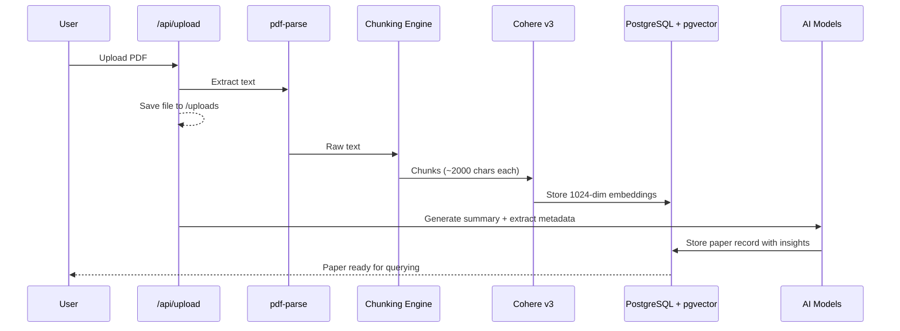
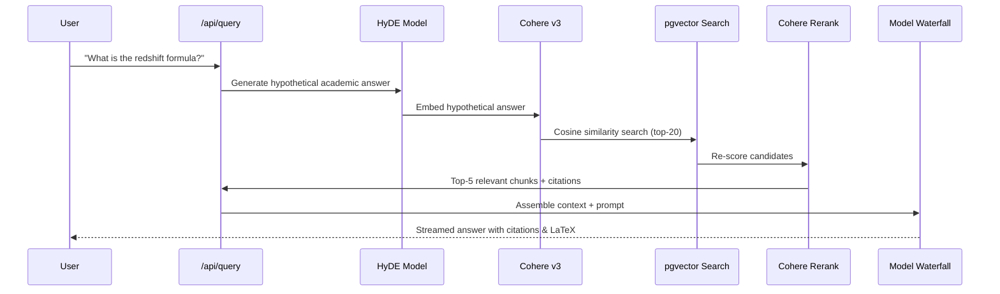

# Research Paper RAG Assistant

An AI-powered tool that helps you actually *read* and *understand* your research papers — instead of letting them collect dust in a folder somewhere.

Upload your PDFs, ask questions in plain language, and get precise answers with citations pointing back to the exact source paragraphs. It's like having a research partner who's read everything and never forgets a detail.

> **Privacy first:** Your papers stay on your machine. Only vector embeddings ever leave the server — the actual text and PDFs never get uploaded to third-party storage.

---

## What It Does

- **Ask questions across papers** — "How does Paper A's methodology compare to Paper B?" works out of the box. The system detects multi-paper queries and synthesizes across sources automatically.
- **HyDE-powered search** — Instead of naive keyword matching, your question gets transformed into a hypothetical academic answer first, then *that* gets matched against your papers. This dramatically improves retrieval quality for technical queries.
- **Auto-generated summaries** — Every paper gets a TL;DR and extracted metadata (title, authors, year) on upload, so you can skim your collection at a glance.
- **LaTeX rendering** — Equations render properly. Hubble's Law, loss functions, integrals — they all look right, not like broken markup.
- **Source citations** — Every claim links back to the original chunk. Click it, read the source, verify the answer.
- **Resilient AI** — If one model is rate-limited or down, the system automatically falls through to the next one. You don't notice; it just works.

---

## System Architecture

Here's how the pieces fit together at a high level:



---

## Workflow: Upload → Query → Answer

### Document Ingestion



### Query & Synthesis



---

## Under the Hood

### How Your Data Stays Private

When you upload a PDF, the file itself gets stored locally in `/uploads`. The text is extracted and chunked on *your* server. Only the numeric vector embeddings (not the text) are sent to Cohere for encoding. When you query, the LLM receives curated context snippets — never the full paper.

### The Model Waterfall

Nobody likes staring at a spinner because an API is rate-limited. The system tries models in priority order — if one fails (429, timeout, error), it immediately tries the next:

1. **Cohere Command R7B / R+** (primary)
2. **Gemini 2.0 Flash / 1.5 Pro** (secondary)
3. **DeepSeek V3 / Llama 3.3 70B / Qwen 2.5 72B** (tertiary)
4. **OpenAI GPT-4o Mini** (last-resort fallback)

Switching between models is invisible to you. The response just arrives.

### Math Normalization

Scientific papers (and LLMs) use inconsistent LaTeX delimiters — `\( ... \)`, `\[ ... \]`, `$...$`, `$$...$$` all mixed together. A regex normalization layer on the frontend standardizes everything into valid KaTeX before rendering, so equations always display correctly.

---

## API Endpoints

| Endpoint | Method | What it does |
| :--- | :--- | :--- |
| `/api/upload` | `POST` | Ingests a PDF — extracts text, chunks, embeds, stores, and generates insights |
| `/api/query` | `POST` | Runs the full RAG pipeline: HyDE → vector search → rerank → synthesize |
| `/api/papers` | `GET` | Lists papers (optionally filtered by `?workspaceId=ID`) |
| `/api/workspaces` | `GET/POST` | Manage research workspaces/collections |
| `/api/chat/sessions` | `GET/POST` | Create and list conversation sessions |
| `/api/chat/sessions/:id/messages` | `GET/POST` | Multi-turn chat with conversation history |

---

## Tech Stack

| Layer | Tech |
| :--- | :--- |
| **Framework** | Next.js 16 (App Router + React 19) |
| **AI SDK** | Vercel AI SDK |
| **LLM Providers** | OpenRouter, Google Generative AI, Cohere, OpenAI (waterfall) |
| **Embeddings** | Cohere embed-english-v3.0 (1024-dim) |
| **Reranking** | Cohere rerank-english-v3.0 |
| **Database** | PostgreSQL + pgvector (via Supabase) |
| **ORM** | Prisma |
| **Math** | KaTeX + remark-math + rehype-katex |
| **Styling** | Tailwind CSS v4 |

---

## Database Schema

```
Workspace
  ├── papers: Paper[]
  └── chats: ChatSession[]

Paper
  ├── title, authors, year, summary, url
  └── chunks: DocumentChunk[]

DocumentChunk
  ├── content, section, page
  └── embedding: vector(1024)

ChatSession
  └── messages: Message[]

Message
  ├── role, content
  └── citations (JSON)
```

All relationships cascade on delete — removing a workspace cleans up everything underneath it.

---

## Quick Start

### 1. Install

```bash
git clone <repository-url>
pnpm install
npx prisma db push
```

### 2. Configure

Create a `.env` file:

```bash
OPENROUTER_API_KEY="sk-or-v1-..."
COHERE_API_KEY="..."
DATABASE_URL="postgresql://..."
NEXT_PUBLIC_APP_URL="http://localhost:3000"
```

### 3. Run

```bash
pnpm dev
```

That's it. Open [localhost:3000](http://localhost:3000), upload a paper, and start asking questions.

---

## A Note on Performance

This project runs on **free-tier APIs** (OpenRouter free models, Cohere trial key). The architecture handles production load just fine, but free tiers come with rate limits — expect 5–10 second response times during busy periods. To speed things up, you have two options — both require zero code changes:

- **Paid API keys** — swap your `.env` keys for paid tiers (OpenRouter, Cohere, etc.) and latency drops to under 2 seconds.
- **Local LLMs** — point the model endpoints at a local inference server (e.g., Ollama, vLLM, or LM Studio). Since the system uses OpenAI-compatible APIs, any local model that exposes the same interface works out of the box. Full privacy, no API costs, no rate limits.
